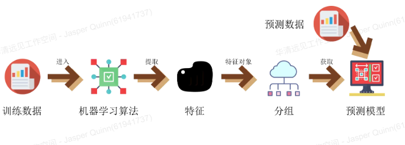
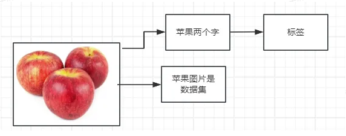

# 机器学习

## 01. 机器学习基本概念概述

### 1.1 机器学习定义

**机器学习（Machine Learning）**：  
本质上是让计算机在已有数据中学习规律，并根据这些规律对未来进行预测。

常见机器学习算法包括：

- **线性回归**
- **逻辑回归**
- **聚类算法**（K-Means）
- **决策树**
- **朴素贝叶斯**
- **深度学习算法**
  - CNN（卷积神经网络）
  - RNN（循环神经网络）
  - LSTM（长短期记忆网络）
    

---

### 1.2 机器学习的发展历史


- **20 世纪 50 年代**：人工智能概念提出，目标是让计算机模拟人类智能。
- **20 世纪 80 年代**：神经网络（BP）开始兴起，尝试模拟人脑神经元结构处理信息。
- 随着时间发展，支持向量机、朴素贝叶斯等算法出现，机器学习由“知识驱动”转向“数据驱动”。
- **2012 年**：算力提升 + 大规模数据 → 深度学习复兴，成为最热门研究方向，推动工业应用爆发。

---

### 1.3 机器学习分类

机器学习根据数据标注情况与学习模式，可分为：

- **监督学习**
- **半监督学习**
- **强化学习**

---

#### 1.3.1 监督学习（Supervised Learning）

##### 1.3.1.1 定义

**基本解释：** 给模型大量已有的**标记数据**（例如：图片 + 标签、人名 + 身份）让它学会从输入推断正确输出，学习好模型后，后用训练好的模型去预测新的未知数据。
**通俗解释：**
想象你在教一个小孩区分“猫”和“狗”。

你给他一堆已经**标好名字的照片**：

- 这张是 **猫**
- 这张是 **狗**
- 这张也是 **猫**
- 这张也是 **狗**

这里需要注意两点：

- **这些照片就是数据集（dataset）**
- **每张照片上写的“猫/狗”就是标签（label）**

小孩一开始不会分，但不断看到“图片 + 正确答案（标签）”后，他开始总结规律：

- 猫的耳朵 **更尖**
- 狗的鼻子 **更大**
- 狗的身体 **更壮**
- 猫的眼睛 **更圆**

当他掌握了这些规律后，你给他一张从未见过的新照片，他已经能自信判断：

> “这应该是猫。”

---

**这就是监督学习的核心流程：**

- 给模型大量 **带标签的数据集** → 模型从中学习规律
- 规律学会后 → 用来 **预测新的未知数据**
- 整个过程就像“老师带着学生做题，让学生从答案中归纳知识”

唯一的区别是：

- **小孩靠大脑学习规律**
- **模型靠数学和算法学习规律**

---

**这就是监督学习的本质：**

- 给模型大量**带答案的数据** → 模型从中学习规律
- 规律学会后 → 用来**预测新的未知数据**
- 整个过程就像“老师带着学生做题”

**唯一的区别：**

- **小孩用的是大脑**
- **模型用的是数学与算法**
  

##### 1.3.1.2 常见算法

1. **线性回归**：通过找到最佳拟合线预测连续值。
2. **逻辑回归**：用于二分类（如 0/1）的监督学习算法。
3. **决策树**：通过树状结构对数据进行分类或回归。

##### 1.3.1.3 常见应用场景

- **分类问题**：垃圾邮件识别、人脸识别
- **回归问题**：股票价格预测、天气预测

---

#### 1.3.2 无监督学习(UnSupervised Learning)

##### 1.3.2.1 定义

**无监督学习**通过分析输入数据的特点和结构，自动地找出数据中的模式和规律不需要人**工标注和干预**
**通俗解释：**
无监督学习好比把一群“没有名字、没有说明书”的东西丢给一个聪明的系统，它不会问你：“这是什么？”  
它会自己观察、自己思考，从数据的形状、分布、相似度里找到规律。

比如：

- 你不给任何标签，把上百张人的照片丢进去
- 模型会自动发现：
  - 有些脸更像一组（可能是男性）
  - 有些脸更像另一组（可能是女性）
  - 还有一些人有眼镜，它也能自动分出来

在整个过程中，没有人告诉它正确答案，也没有人为干预。  
它就是根据**数据本身的结构和特征**，自动把“相似的放一起，不相似的分开”。

---

总结一句话：

> **无监督学习让模型自己在一堆没有标签的数据里找规律，像是在黑暗里摸索，但却能自然形成分类和结构。**

##### 1.3.2.2 常见算法

- 1.**_K-means：_** 用于聚类分析。
- 2.**_DBSCAN：_** 基于密度的算法，发现任意形状的聚类。
- 3.**_层次聚类：_** 基于距离的算法，将数据点按照距离远近进行聚类。

##### 1.3.2.3 应用场景

- 1.**聚类：** 将数据集划分为多个组。
- 2.**降维：** 将高位数据降维，更容易理解和可视化数据。
- 3.**关联规则学习：** 超市购物篮分析中，发现哪些商品经常一起被购买
  

#### 1.3.3 半监督学习(semi-supervised learning)

##### 1.3.3.1 定义

**基本解释：** **半监督学习** 利用标记和未标记的数据来进行训练和预测。

**半监督学习的通俗解释：**

半监督学习就像教一个学生做题，但你手里的资源有限：

- 你只有**少量带答案的题目**（标记数据）
- 还堆着**大量只有题目没有答案的练习册**（未标记数据）

学生会这样学习：

1. 先用“带答案的题”学会基本规律
2. 再把这些规律用到“没答案的题”里，通过反复推断和比较，让自己的理解更深
3. 最终不仅能把带答案的题学会，还能靠自己判断其他新题

所以半监督学习的核心就在于：

> **少量标注指导 + 大量未标注辅助，让模型学得更快、更准，同时减少人工标注成本。**

##### 1.3.3.2 常见算法

- 1.**标签传播：** 通过迭代地传播标签，使得每个样本的标签都尽可能地一致。
- 2.**学习算法：** 通过学习算法可以训练出更好的模型，提高分类准确率。

##### 1.3.3.3 应用场景

- 1.**分类问题：** 垃圾邮件识别、人脸识别等。
- 2.**聚类问题：** 市场细分、社交网络分析等。
  

#### 1.3.4 强化学习(reinforcement learning)

##### 1.3.4.1 定义

**强化学习**通过试错的方式让机器学习如何做出最优决策，最重点的就是智能体和现实环境的交互

**通俗解释：**

强化学习就像训练一只“小聪明的宠物”做任务。

你不会提前告诉它怎么做，也不给它现成的答案，它只能靠**不断尝试、不断犯错、不断总结**来找到最好的做法。

整个过程包含两样东西：

- **智能体（Agent）**：像宠物一样“执行动作”的角色
- **环境（Environment）**：智能体行动所处的世界，会给它奖励或惩罚

举个特别好懂的例子：

你在教小狗钻火圈。

- 小狗试着跳过去，摔下来 → **环境给惩罚**
- 小狗试出正确的跳法，成功穿过去 → **环境给奖励**
- 小狗会把“奖励最多的行为”记下来，下次更容易成功

于是，小狗通过无数次**试错 + 奖励反馈**，最终学会最佳动作。

强化学习的核心就是：

> **让智能体与环境不断互动，通过奖励和惩罚，引导它学会最优决策。**

##### 1.3.4.2 常见算法

- **Q-Learning：** 构建 Q 表来对环境进行建模实现决策。
- **Deep Q Network (DQN)：** 结合深度学习通过训练神经网络来逼近 Q 函数，实现更高效的学习。
- **Policy Gradient Methods：** 优化策略寻找最优解。

### 1.4.应用场景


### 1.5.机器学习发展概述


## 02. 机器学习相关算法

### 2.1 监督学习中的 KNN 算法

**算法概述：**
KNN 算法概念
**K 最近邻(K-Nearest Neighbor,KNN)分类算**法是数据挖掘分类技术中最简单的方法之一，
是著名的模式识别统计学方法，在机器学习分类算法中占有相当大的地位。
它是一个理论上比较成熟的方法。既是最简单的机器学习算法之一，
也是**基于实例**的学习方法中最基本的，又是最好的文本分类算法之一。

- **什么是基于实例学习：**
  **基于实例”（Instance-Based）**指的是：  
   模型**不真正建立复杂的数学公式或函数**，而是把训练数据当成“记忆的实例”保存下来，当有新数据来时，通过比较相似程度来做判断。

  | 类型                           | 思路                                    | 举例                       |
  | ------------------------------ | --------------------------------------- | -------------------------- |
  | **基于实例（Instance-Based）** | 保存训练样本，新样本靠相似度分类        | KNN                        |
  | **基于模型（Model-Based）**    | 从数据中训练出模型/方程，然后用模型预测 | 逻辑回归、决策树、神经网络 |

  **基于模型**：我总结规律，靠规律判断  
  **基于实例**：我不总结，只靠“像不像”判断
  **基于实例 = 靠存例子 + 比距离做判断，而不是构建模型。**

#### 2.1.1 算法介绍

> 该算法就是根据设定好的标签和分类好的数据，画出这些分类好数据的数据边界，再往里放入数据时，该算法就会根据之前设计好的边界分类你重新加入的数据。
> 该算法主是监督学习算法，所以要先预设好带有数据标签的数据集，
> 交叉验证方法主要增强鲁棒性

##### 2.1.1.1 定义

KNN(K-Nearest Neighbor) **k 个最近的邻居**，即每个样本都可以用它最接近的 k 个邻居来代表,KNN 算法属于监督学习方式的分类算法，通过测量不同数据点之间的**距离**进行**分类**或**回归分析**。

- **什么是回归分析：**
  回归分析是一种根据“已有的数值数据”来**预测一个连续数值**的方法。

  > **回归 = 预测一个具体的数字，而不是判断类别。** > **回归不是问：“它属于哪一类？”  
  > 回归是在问：“它到底是多少？”**

  - **最好理解的例子：预测房价**
    你给模型大量**带标签的数据**：

    > 房子面积：80㎡ → 价格 82 万
    > 房子面积：100㎡ → 价格 105 万
    > 房子面积：130㎡ → 价格 140 万
    > **模型从中学会：** **面积越大 → 房价越高 > 之后你给它一个新的数据：** > 120㎡ 的房子**模型不告诉你这是 A 类或 B 类房子**，而是**直接回答**：大概值 **128 万**这就是回归分析。

    | 任务     | 回答的结果       | 例子             |
    | -------- | ---------------- | ---------------- |
    | **分类** | 哪一类？         | “这是狗还是猫？” |
    | **回归** | 具体数值是多少？ | “这房子多少钱？” |

##### 2.1.1.2 原理

“近朱者赤” **基于实例 (instance-based learning)** 的学习,属于 **懒惰学习(Lazy learning)**,即 KNN 没有显示的学习过程，也就是说没有训练阶段（仅仅是把样本保存起来，训练时间开销为零）它是通过测量不同数据点的之间的距离进行**分类**或者**回归**。

##### 2.1.1.3 特点

- KNN 算法简单易懂，易于实现
- **无需训练阶段，直接进行分类或者回归**
- **适用于多分类问题**
- **对数据集的大小和维度不敏感**

#### 2.2KNN 算法三要素

##### 概述

- **1.K 值选择**
  “要参考的最近邻居数量”。它决定了模型是在“听少数人的意见”，还是“听多数人的意见”。
- **2.距离选择**
  KNN 的核心思想是：“近的相似，远的不同”。所以“近”必须有一个衡量方式，这就是**距离度量：**

  - **欧氏距离（Euclidean Distance）**

    - 最常见，用于空间直线距离
    - 类似地图中两点之间的直线

  - **曼哈顿距离（Manhattan Distance）**

    - 用于具有网格结构的数据
    - 走“横平竖直”的距离更合适

  - **切比雪夫距离（Chebyshev Distance）**

    - 适合棋盘、像国际象棋国王移动那样的场景

  - **闵可夫斯基距离（Minkowski Distance）**
    - 欧氏 + 曼哈顿 的更一般版本
    - 距离度量更灵活

- **3.分类规则选择**
  KNN 找到 K 个邻居之后，需要确定最终类别。常见**决策方式**有两种：

  - **多数投票（Majority Voting）**

    - 哪个类别出现次数最多，就选哪个
    - 应用于分类任务（Classification）

  - **距离加权投票（Weighted Voting）**
    - 最近的邻居权重更大
    - 距离越近 → 权重越高
    - 可以更好地处理“局部密度不均匀”的场景

##### **2.2.1 K 值选择**

算法中的 K 在 KNN 中，称为**超参数(Hyper parameter)(超参数就是需要你手动设定的参数)**，需要人为选择不同的 K 值，这个参数是需要人为选择的。
**K 值选择存在的问题：**
**K 值过小：**

- 优点：复杂的数据集，K 值较小可能会提供更详细的决策边界，因为模型更加灵活。
- 缺点：容易受到局部结构的影响，模型受噪声和异常值的影响更大。
  选择较小的 K 值，就相当于用较小的领域中的训练实例进行预测，“学习”近似误差会减小，只有与输入实例较近或相似的训练 实例才会对预测结果起作用，与此同时带来的问题是“学习”的估计误差会增大，换句话说，K 值的减小就意味着整体模型变得 复杂，容易发生过拟合；

**k 值过大：**

- 优点：考虑了更多的全局信息，对于平滑的数据集，较大的 K 值可以提供更稳定的决策边界。
- 缺点：对于复杂的数据集，较大的 K 值可能会导致模型过于简单，无法准确捕获数据的局部特征。

选择较大的 K 值，就相当于用较大领域中的训练实例进行预测，其优点是可以减少学习的估计误差，但缺点是学习的近差会增大。这时候，与输入实例较远（不相似的）训练实例也会对预测器作用，使预测发生错误，且 **K 值的增大就意着体的模型变得简单。**
**极端情况**，K=N（N 为训练样本个数），则完全不足取，因为此时无论输入实例是什么，都只是简单的预测它属于练实例中最多的类，模型过于简单，忽略了训练实例中大量有用信息。
**如何选择最优的 K 值？**
在实际应用中，**K 值一般取一个比较适中的数值**，例如采用交叉验证法（简单来说，就是把训练数据在分成两组:训练集验证集）来选择最优的 K 值。

##### **2.2.2 距离选择**

**k 近邻法(K-Nearest Neighbor,KNN)**：计算新的点(测试点)到每一个已知点(标签点)的距离，并比对距离,使用不同的距离公式会得到不同的分类效果。后面会介绍一下常用的距离计算方法。

##### **2.2.3 分类规则选择**

- **分类问题：** 对新的实例，根据与之相邻的 k 个训练实例的类别，通过多数表决法或者加权多数表决法等方式进行预测
- **回归问题：** 对新的实例，根据与之相邻的 K 个训练实例的标签，通过均值计算进行预测。

#### 2.3KNN 算法步骤

**输入：** 训练数据集 T={(x1,y1),(x2,y2)...(xn,yn)},x1 为实例的特征向量，yi={c1,c2,c3...ck}为实例类别。
**输出：** 测试实例 x 所属的类别 y。
**步骤：**

- (1)选择参数 **K**
- (2)计算未知实例与所有已知实例的距离(可选择多种计算**距离**的方式)
- (3)选择最近 K 个已知实例
- (4)根据少数服从多数的**投票法则(Majority-voting)**,让未知实例归类为 K 个最近邻样本中最多数的类别。

#### 2.4 KNN 算法思想

#### 2.5 决策边界可视化代码实现

K 近邻算法，假定给定一个训练数据集，其中实例标签已定，当输入新的实例时，可以根据其最近的 k 个训练实例的标签，预测新实例对应的标注信息(标签属于哪一类)
图中绿色的点就是我们要预测的那个点，假设 K=3。那么 KNN 算法就会找到与它距离最近的三个点（这里用圆圈把它圈起来了），看看哪种类别多一些，比如这个例子中是蓝色三角形多一些，新来的绿色点就归类到蓝三角了。

```python
# 导入库
# 从sklearn 导入分类的库，KNeighborsClassifier 是 KNN 算法的核心分类器
from sklearn.neighbors import KNeighborsClassifier

# 导入numpy，numpy 是用于数值计算的库，主要用于处理数组
import numpy as np

# 导入画图包，matplotlib 用于数据可视化
import matplotlib.pyplot as plt

# 目前使用课件上的数据集
# 定义三个点集合，代表不同类别的数据点，分别有两个特征（例如：坐标位置）
point1 = [
    [7.7, 6.1],  # 类别 0 的点
    [3.1, 5.9],
    [8.6, 8.8],
    [9.5, 7.3],
    [3.9, 7.4],
    [5.0, 5.3],
    [1.0, 7.3],
]
point2 = [
    [0.2, 2.2],  # 类别 1 的点
    [4.5, 4.1],
    [0.5, 1.1],
    [2.7, 3.0],
    [4.7, 0.2],
    [2.9, 3.3],
    [7.3, 7.9],
]
point3 = [
    [9.2, 0.7],  # 类别 2 的点
    [9.2, 2.1],
    [7.3, 4.5],
    [8.9, 2.9],
    [9.5, 3.7],
    [7.7, 3.7],
    [9.4, 2.4],
]

# 将数据集连接起来，将三个点集合合并成一个大的数据集
# np.concatenate: 用于连接多个数组
# axis=0 表示按行进行拼接
point_concat = np.concatenate((point1, point2, point3), axis=0)

# 设置标签，将每个数据点与其对应的类别标签进行配对
# np.zeros(len(point1)) 给 point1 的所有点分配标签 0
# np.ones(len(point2)) 给 point2 的所有点分配标签 1
# np.ones(len(point3)) + 1 给 point3 的所有点分配标签 2
point_concat_label = np.concatenate(
    (np.zeros(len(point1)), np.ones(len(point2)), np.ones(len(point3)) + 1),
    axis=0,
)

# 2. 构建KNN算法，实例化KNN算法并进行训练
# 2.1 第一步实例化KNN算法，指定邻居数量、距离度量方式等参数
n_neighbors = 5  # 确定K值（即邻居数），这里设定为5

# 使用 KNeighborsClassifier 实例化 KNN 算法模型
# n_neighbors: 选择的邻居数量，指定 KNN 算法考虑的邻居数目
# algorithm: 'brute' 表示使用暴力计算方法，即计算每个点与所有点的距离
# p: 距离度量的参数，p=2 表示使用欧几里得距离
knn = KNeighborsClassifier(
    n_neighbors=n_neighbors,  # 设置 K 值为 5
    algorithm="brute",  # 使用暴力算法来计算距离
    p=2,  # 使用欧几里得距离（p=2）
)

# 训练 KNN 模型
# knn.fit() 函数会根据训练数据（point_concat）和标签（point_concat_label）来学习
# 该函数将模型拟合到数据上，学习数据的特征与标签之间的关系
knn.fit(point_concat, point_concat_label)

# 3. 实现KNN决策边界的可视化
# 通过预测坐标网格上所有点的类别来绘制决策边界
# 获得预测点数据，使用坐标点网格来当作预测数据点
# 3.1 设定未知点，生成一个坐标点网格，表示我们希望预测的点位置
x1 = np.linspace(0, 10, 100)  # 生成从0到10的100个点，作为 x 轴的坐标
# np.linspace: 生成指定范围内的等间距数值
# 第一个参数是数据的起始值，第二个参数是结束值，第三个是生成数值的个数
y1 = np.linspace(0, 10, 100)  # 生成从0到10的100个点，作为 y 轴的坐标

# 生成坐标点网格，x_axis 和 y_axis 是二维矩阵
# meshgrid 用于生成网格坐标点，用于在平面上覆盖坐标点
x_axis, y_axis = np.meshgrid(x1, y1)

# 输出网格形状（这是一个二维的网格，用来覆盖平面）
# 网格的形状（每个轴的维度）对于决策边界的绘制非常重要
y_axis.shape

# 将 x_axis 和 y_axis 展平，转化为一维数组，以便用来做预测
# 使用 ravel() 或者 flatten() 展平 2D 数组
x_axis_ravel = x_axis.ravel()
y_axis_ravel = y_axis.ravel()

# 合并两个一维数组，得到所有网格坐标的二维形式
# np.c_[] 用来按列将两个一维数组合并成一个二维数组
xy_axis = np.c_[x_axis_ravel, y_axis_ravel]

# 4. KNN预测与绘制决策边界
# 对所有坐标点进行分类预测，knn.predict 返回的是对应点的预测标签
# knn.predict() 通过KNN模型对输入的二维数据（xy_axis）进行分类预测
knn_predict_result = knn.predict(xy_axis)

# 画图展示决策边界
# 创建一个新图形，设置图形尺寸
fig = plt.figure(figsize=(15, 20))

# 添加子图，ax 表示一个图形区域
# 111 表示 1 行 1 列的第一个图
ax = fig.add_subplot(111)

# contour: 绘制等高线，表示决策边界
# 第一个和第二个参数是坐标点网格，第三个参数是每个坐标点的预测标签
# 这里将预测结果（knn_predict_result）按网格的形状重塑，以便绘制边界
ax.contour(
    x_axis,  # x 轴坐标
    y_axis,  # y 轴坐标
    knn_predict_result.reshape(x_axis.shape),  # 将预测结果按网格形状重塑
)

# 绘制原始点的散点图
# ax.scatter 用于绘制散点，分为三个类别
# point_concat[point_concat_label == 0, 0]
# 和 point_concat[point_concat_label == 0, 1]
# 用于筛选属于类别 0 的点
ax.scatter(
    point_concat[point_concat_label == 0, 0],  # 类别 0 的 x 坐标
    point_concat[point_concat_label == 0, 1],  # 类别 0 的 y 坐标
    color="b",  # 蓝色
    marker="^",  # 使用三角形标记
)

ax.scatter(
    point_concat[point_concat_label == 1, 0],  # 类别 1 的 x 坐标
    point_concat[point_concat_label == 1, 1],  # 类别 1 的 y 坐标
    color="r",  # 红色
    marker="*",  # 使用星形标记
)

ax.scatter(
    point_concat[point_concat_label == 2, 0],  # 类别 2 的 x 坐标
    point_concat[point_concat_label == 2, 1],  # 类别 2 的 y 坐标
    color="y",  # 黄色
    marker="s",  # 使用方形标记
)

# 显示图形
# plt.show() 展示整个图形，确保图形可视化
plt.show()

```
